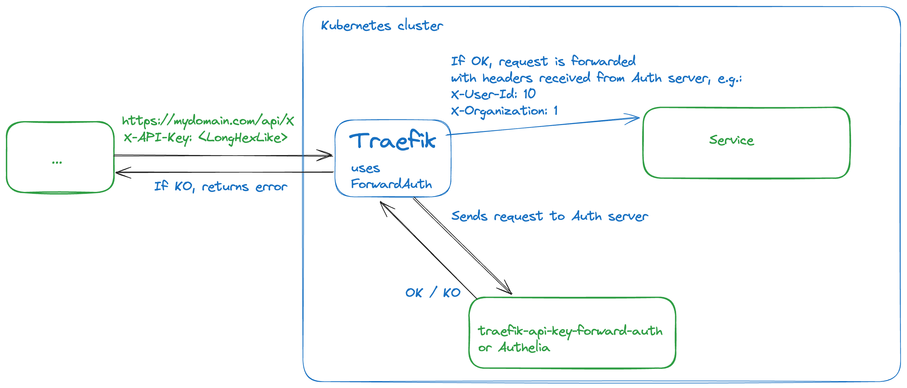

# Forward auth authentication microservice for Traefik

[Forward authentication](https://doc.traefik.io/traefik/middlewares/http/forwardauth/) microservice for reverse-proxy Traefik, acting as Ingress Controller.  
It handles "API Key" based authentication, which is used by API providers.  
If you need authenticate user using SAML, OIDC, consider using [Authelia](https://www.authelia.com/).



## What is Traefik and forward auth?

Traefik is a popular reverse-proxy, written in Go, highly customizable, fast and robust.  
It can be used within Kubernetes cluster as an Ingress controller to route incoming requests to responsible services.  
The ForwardAuth middleware delegates authentication to an external service. If the service answers with a 2XX code, access is granted, and the original request is performed. Otherwise, the response from the authentication server is returned.

## API

`traefik-api-key-forward-auth` provides two interfaces:

1. Authentication endpoint - GET `/api/auth`  

    It is called by Traefik service for every incoming request.

    Request headers are:  
    | Property            | Forward-Request Header  |
    |---------------------|-------------------------|
    | HTTP Method         | X-Forwarded-Method      |
    | Protocol            | X-Forwarded-Proto       |
    | Host                | X-Forwarded-Host        |
    | Request URI         | X-Forwarded-Uri         |
    | Source IP-Address   | X-Forwarded-For         |

    It returns HTTP 200 response code with additional headers including authentication details

2. Management endpoints

    2.1. API Keys  
        API Keys are managed with CRD REST endpoint

    2.1.1. GET `/api/key?filter=<filter>&limit=N&after=<ID>`
    Returns filtered list of API Keys filtered.
    Default limit value is 50

    Returned array of API keys:

    ```json
    [
        {
            "id": "ID",
            "key": "key with asterisks in the middle",
            "createdAt": "<date>",
            "projectId": "<optional>",
            "organizationId": "<optional>",
            "userId": "<optional>",
            "attributes": {}
        }, ...
    ]
    ```

    2.1.2 POST `/api/key`
    Creates a new API Key

    Request body:

    ```json
    {
        "projectId": "<optional>",
        "organizationId": "<optional>",
        "userId": "<optional>",
        "attributes": {"optional": "optional"}
    }
    ```

    Response:

    ```json
    {
        "id": "ID",
        "key": "API Key"
    }
    ```

    2.1.3 DELETE `/api/key/{id}`
    Deletes API Key by given id

## Configuration

Configuration is provided with environment variables:

* API_SECRET - (required) authentication token for management endpoints
* DATABASE_URL - (required) URL for database to store API Keys
* CACHE_TYPE - (optional, default = "memory") Type of cache to use. Allowed values = no, memory, redis
* CACHE_MEMORY_LIMIT - (optional) Maximum number of keys to cache, default = 100000
* CACHE_REDIS_URL - (optional) URL of Redis cache
* FAILS_TO_BAN - (optional) Number per minute of failed tries to authenticate before ban per IP (default = 10)
* BAN_DURATION - (optional) Ban duration (in seconds, default = 1800)
